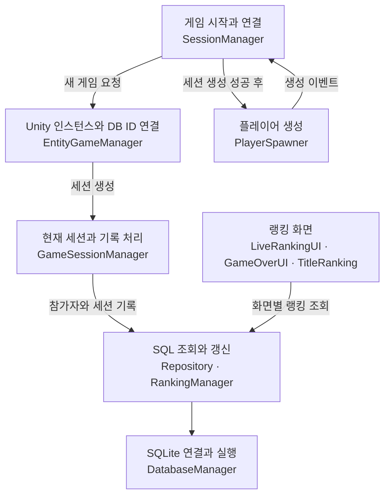
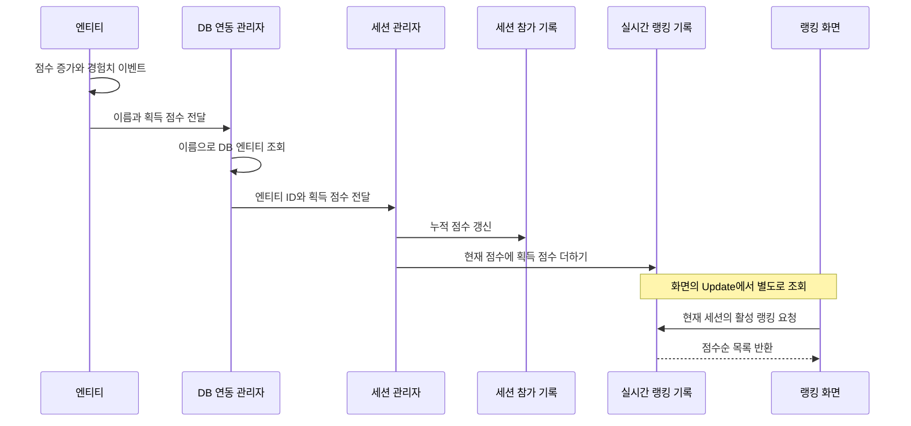

# Arrow.io 클론 프로젝트: 게임 기록이 랭킹 화면에 도달하기까지

개발 기간: **2025-05-20 ~ 2025-06-15**. 프로젝트명과 기간은 사용자 확인 사항입니다.

이 프로젝트의 핵심은 **Unity 안에서 발생한 점수·사망 이벤트를 SQLite 기록으로 남기고, 그 기록을 게임 중·종료 후·타이틀 랭킹으로 다시 보여주는 흐름**입니다. 플레이어와 AI를 같은 엔티티 구조로 다루되, 한 게임의 기록과 여러 게임에 걸친 기록을 나누어 저장합니다.

> 2026-10-01 UTC 문서 갱신. 공개 코드의 호출 관계와 SQL을 읽어 작성했습니다. Unity·DB 실행이나 플레이 테스트 결과가 아닙니다.
>
> **이 저장소는 바로 실행할 수 있는 Unity 프로젝트가 아닌 코드 검토용 선별 사본입니다.** 씬·프리팹·실제 ScriptableObject 데이터·외부 DLL 등이 없고, 제외된 `Projectile.cs` 때문에 해결되지 않는 타입 참조도 있습니다. 실행 범위, 팀 기여, 라이선스와 최초 게시 검증 기록은 부록에 남겼습니다.

## 1. 게임을 시작하면 먼저 기록할 자리를 만든다

[SessionManager][session]는 게임 씬의 연결 지점입니다. `Awake`에서 스포너에 피해 팝업·킬 로그·점수 블록 관리자와 기본 능력치를 전달하고, 생성·사망 이벤트를 구독합니다. 이후 `StartGame`은 다음 순서로 진행됩니다.

1. 이전 게임의 임시 랭킹인 `SessionRanking`을 비웁니다.
2. [EntityGameManager.StartNewGame][entity-manager]이 기존 활성 세션을 정리하고, Unity 인스턴스와 DB 엔티티의 ID 매핑을 초기화합니다.
3. [GameSessionManager.StartSession][game-session]이 플레이어 → 플레이어 엔티티 → 게임 세션 → 세션 참가 기록 → 실시간 랭킹 행을 차례로 만듭니다.
4. 세션 생성에 성공하면 [PlayerSpawner][player-spawner]가 플레이어를 생성합니다. 생성 이벤트를 받은 `SessionManager`가 UI와 카메라를 연결하고 플레이어 인스턴스 ID를 DB 엔티티 ID에 대응시킵니다.

`StartSession`의 주석에는 기존 플레이어 조회도 언급되어 있지만, 실제 [PlayerRepository.CreatePlayer][player-repository]는 매번 `INSERT`합니다. **같은 이름을 다시 입력해도 기존 계정을 재사용하는 구조로 설명할 수 없습니다.**

DB 연결은 별도 [DatabaseInitializer][initializer]가 담당합니다. 코드의 기본 설정은 `Awake`에서 초기화하는 것이며, [DatabaseManager.Initialize][database]가 `Application.persistentDataPath/gamedata.db`를 열고 테이블·인덱스·뷰를 준비합니다. 씬이 빠져 있으므로 이 컴포넌트의 실제 배치와 Inspector 설정은 확인하지 않았습니다.

그림은 주요 호출 관계입니다. 초기화가 저절로 보장되거나 모든 처리 과정이 하나의 트랜잭션이라는 뜻은 아닙니다.

## 2. 점수 획득은 게임 상태와 DB를 함께 바꾼다

공통 기반 클래스 [Entity][entity]의 `AddScore`가 핵심입니다. 게임 안의 `EntityData.Score`를 올리고 경험치 이벤트를 보낸 뒤, 엔티티 이름과 **이번에 얻은 점수**를 DB 연동 계층으로 전달합니다. 마지막 공격자에게 처치 점수를 주는 `GiveScoreToLastAttacker`도 이 메서드를 사용하며, 현재 값은 400점입니다.

- **게임 → DB:** `Entity.AddScore` → `EntityGameManager.OnEntityScoreAddbyName` → `GameSessionManager.AddEntityScore` 순서입니다. 사망 처리와 달리 이 점수 경로는 인스턴스 ID 매핑이 아니라 이름 조회를 사용합니다.
- **두 기록 갱신:** [SessionEntityRepository.AddEntityScore][session-entity]는 해당 게임 참가자의 점수를 올리고, [RankingManager.UpdateLiveRanking][ranking]은 `SessionRanking.CurrentScore`에 전달값을 더합니다. 메서드 이름의 “Update”를 점수 덮어쓰기로 해석하면 안 됩니다.
- **DB → 화면:** [LiveRankingUI.Update][live-ui]가 매 프레임 상위 목록과 플레이어 행을 조회합니다. DB 변경 이벤트를 구독해 필요한 순간에만 새로고침하는 방식은 아닙니다. 경험치·레벨 HUD는 이와 별도로 [UIController][ui]가 엔티티 이벤트를 받아 갱신합니다.

점수가 1,000점 경계를 넘을 때마다 `Entity.AddScore`는 레벨업 처리와 `onLevelup`을 호출합니다. 하지만 이 호출 경로는 DB에 레벨 인자를 전달하지 않습니다. 게임 내 레벨이 랭킹 DB에도 자동으로 같은 값으로 저장된다고 단정할 수 없습니다. 또 확인한 처치 이벤트는 `AddScore`를 호출하며, 별도의 `OnEntityKilled`·`IncrementEntityKills` 경로를 호출하지 않습니다. 점수 증가와 DB 처치 수 증가는 구분해서 읽어야 합니다.

## 3. 저장 구조와 세 종류의 랭킹

[DatabaseManager의 테이블 정의][database]는 다음처럼 역할을 나눕니다.

| 저장 대상 | 역할과 연결 |
| --- | --- |
| `Players` | 이름, 최고 점수, 게임 수와 누적 플레이 시간 |
| `Entities` | Player·AI 공통 식별자. `PlayerID`는 선택값으로 플레이어 기록과 연결 |
| `GameSessions` | 한 게임의 시작·종료 시각, 플레이 시간과 완료 여부 |
| `SessionEntities` | `SessionID + EntityID`별 점수·레벨·처치 수·생사 상태. 두 ID 조합은 유일 |
| `SessionRanking` | 같은 두 ID 조합의 임시 랭킹. 현재 점수와 활성 여부를 따로 저장 |

`SessionEntities`와 `SessionRanking`은 각각 `GameSessions`와 `Entities`를 외래 키로 참조합니다. 전자는 완료된 게임 기록에도 사용하고, 후자는 현재 게임과 직전 종료 화면에 사용합니다. **`SessionRanking`은 이름이나 주석과 관계없이 실제 테이블입니다.**

화면이 읽는 자료도 서로 다릅니다.

| 화면 | 실제 조회 경로 | 읽는 범위 |
| --- | --- | --- |
| 게임 중 [LiveRankingUI][live-ui] | `GetActiveSessionLiveRanking` | 현재 세션의 `SessionRanking` 중 `IsActive = TRUE` |
| 종료 [GameOverUI][game-over] | `GetSessionEndRanking` | 저장해 둔 세션 ID의 `SessionRanking` 중 `IsActive = FALSE` |
| 타이틀 [TitleRanking][title-ranking] | `GetPlayerBestRanking` 또는 `GetAllTimeRanking` | 완료된 세션의 `SessionEntities`를 엔티티·세션 정보와 결합 |

DB에는 `AllTimeRanking`, `PlayerBestRanking`, `LiveRanking`, `SessionFinalRanking` 뷰도 정의되어 있습니다. 그러나 위 화면의 주요 조회 메서드는 해당 이름의 뷰를 그대로 읽지 않고 별도 SQL을 실행합니다. 특히 `GetPlayerBestRanking`은 완료된 Player 참가 기록을 점수순으로 나열하므로 **계정별 최고 기록 한 건**을 보장하지 않습니다.

새 게임이 시작되면 `ClearAllSessionRanking`이 임시 랭킹 전체를 삭제합니다. 완료 게임을 조회하는 타이틀 랭킹은 남아 있는 `SessionEntities`와 `GameSessions`를 사용하므로 이 삭제와 구분됩니다.

## 4. 사망하면 기록을 닫고 종료 화면을 보여준다

### 플레이어 사망

[Player.Update][player]는 HP가 0 이하가 된 첫 프레임에 사망 애니메이션과 콜라이더 비활성화를 처리하고 `onDeath`를 보냅니다. 다음 프레임부터는 공격·입력을 처리하지 않습니다.

사망 이벤트에서 `PlayerSpawner.HandlePlayerDeath` → `SessionManager.EndGame` → `EntityGameManager.OnPlayerDeath` → `GameSessionManager.OnPlayerDeath`가 이어집니다. DB 처리는 다음 두 단계입니다.

1. 플레이어의 `SessionEntities`를 사망 상태로 바꾸고 실시간 랭킹 행을 비활성화합니다.
2. `EndSession`이 플레이어 통계, 세션 종료 정보, 모든 참가자의 랭킹 비활성화 처리를 수행한 뒤 현재 세션·플레이어 ID를 초기화합니다.

[UIController.Setup][ui]도 같은 사망 이벤트에 종료 화면 표시를 등록합니다. [GameOverUI.Setup][game-over]은 세션 ID를 미리 보관하고, 종료 시 현재 활성 ID가 초기화되어도 그 ID로 랭킹을 조회합니다. 코드상 이벤트 등록 순서는 스포너의 종료 처리 후 UI 연결입니다. 실제 씬에서 추가로 등록된 Inspector 이벤트와 화면 연출 결과까지 검증한 것은 아닙니다.

현재 `EndSession`은 **세션 플레이 시간을 최종 계산하기 전에** 플레이어 누적 통계에 기존 `PlayTimeSeconds`를 더합니다. 따라서 [GameSessionRepository.EndSession][session-repository]의 시간 계산과 누적 통계 반영 순서는 개선 검토가 필요한 지점입니다.

### AI 사망과 풀 재사용

[EnemySpawner][enemy-spawner]는 풀에서 적을 꺼내 초기화하고, [Enemy.Setup][enemy]은 AI를 세션에 등록합니다. 생성 간격은 DB에서 읽은 살아 있는 AI 수와 `spawnMultiplier`로 계산합니다. 선언된 `maxEnemyCount = 10`은 이 경로에서 상한 검사에 사용되지 않습니다.

적의 사망 이벤트는 `StartDespawnTimer`로 연결됩니다. 코루틴은 먼저 인스턴스 ID 매핑으로 DB 사망 처리를 하고, 5초를 기다린 뒤 풀에 반환합니다. DB에서 비활성화되는 시점과 게임 오브젝트가 풀로 돌아가는 시점이 다릅니다.

## 5. 전투 행동은 DB 처리와 어떻게 나뉘는가

플레이어와 적은 [Entity][entity]의 피해·점수·무기·사망 이벤트를 공유하지만 행동 입력은 다릅니다.

- [Player][player]는 방향키와 마우스를 읽어 이동·조준하며, 살아 있는 동안 `Update`에서 `Attack`을 호출합니다.
- [Enemy][enemy]는 `Update`에서 [FSM.Execute][fsm]를 호출합니다. 상태 객체는 행동을 실행하고 전이 객체는 다음 상태의 조건을 검사합니다.
- `FSM.Setup`에 기록된 전이 등록 순서는 사망 → 도주 → 공격 → 추적 → 순찰 → 대기입니다. `Execute`는 사전을 순회하다 처음 참인 조건에서 멈추고, 상태가 달라지면 이전 상태의 `Exit`와 새 상태의 `Enter`를 거쳐 `Execute`를 호출합니다. 의도한 우선순위가 사전 열거 순서에 기대고 있다는 점도 함께 읽어야 합니다.
- 공통 `Entity.Attack`은 무기에 발사를 요청합니다. 공개 범위에서는 투사체 기반 클래스가 제외되어 있으므로 발사부터 충돌·피해 적용까지의 완전한 실행을 확인할 수 없습니다.

따라서 읽기 순서는 **`SessionManager` → `Entity` → DB 연동 관리자 두 개 → `RankingManager` → 화면 코드**가 좋습니다. 이후 플레이어 조작이나 FSM을 읽으면 전투 이벤트가 어떤 기록으로 이어지는지 연결하기 쉽습니다.

## 문서 기준과 검증 범위

본문 링크는 공개 사본의 최초 게시 커밋 [`4b6183c3`](https://github.com/als79gur49/2025-DB-TeamProject-code-portfolio/commit/4b6183c3c6b58f403333e23d965aa582ae9a2ae3)에 고정했습니다. 원본 비공개 저장소는 이번 설명 작성 과정에서 새로 조회하지 않았습니다. 원본 버전과 선별 경위는 아래 최초 게시 기록을 따릅니다.

이번 변경 대상은 `README.md`뿐입니다. 코드·설정 82개와 출처·검증 파일은 변경하지 않습니다. [MANIFEST.csv](MANIFEST.csv)의 원본 파일 해시는 그대로 유효하며, [VALIDATION.json](VALIDATION.json)에 기록된 **README 크기·SHA-256는 최초 게시 당시 README의 값**입니다. 갱신된 README에 적용하는 해시가 아닙니다. 최초 버전은 [이 링크](https://github.com/als79gur49/2025-DB-TeamProject-code-portfolio/blob/4b6183c3c6b58f403333e23d965aa582ae9a2ae3/README.md)에서 확인할 수 있습니다.

호출 관계, SQL, 코드 링크와 Mermaid의 기본 구문을 정적으로 점검했습니다. Unity·DB 실행, 빌드, 성능 측정은 하지 않았으며 GitHub의 실제 다이어그램 렌더링도 검증하지 않았습니다. 실패 처리의 원자성이나 전체 결함을 검증한 문서는 아닙니다.

## 부록: 최초 공개 범위·출처·보존 기록

아래는 최초 게시 문서의 범위와 제한을 보존한 기록입니다. “최종” 파일 목록과 해시 설명은 최초 게시 시점 기준으로 읽어야 합니다.

원본: 비공개 [als79gur49/2025-DB-TeamProject](https://github.com/als79gur49/2025-DB-TeamProject), `Branch_03_Diet`의 고정 커밋 [`67ee6cdf472e2a3888d367b96d426ae3cf9443da`](https://github.com/als79gur49/2025-DB-TeamProject/commit/67ee6cdf472e2a3888d367b96d426ae3cf9443da). 모든 보존 파일은 이 커밋을 기준으로 합니다. 링크는 원본 접근 권한이 있어야 열립니다.

### 검토 범위와 실행 제한

원본 트리의 파일 14,099개 중 `Assets/Scripts` C# 84개와 `Assets/SO` C# 3개를 후보로 삼아, 승인된 8개를 제외한 **C# 79개**를 보존했습니다. `Assets/SO`의 3개는 ScriptableObject **클래스 정의**이며 실제 `.asset` 인스턴스는 포함하지 않습니다. 설정 3개는 `ReviewContext` 아래에 원래 경로를 유지했습니다.

총 **87개 파일**: 코드 79 + 설정 3 + `README.md`, `CONTRIBUTIONS.md`, `MANIFEST.csv`, `VALIDATION.json`, `.gitignore` 5개. 원본에서 보존하지 않은 파일은 14,017개입니다. 원본 Git 이력과 `.git`은 포함하지 않으며 로컬 Git 초기화는 수행하지 않았습니다. 공개 게시 대상은 [als79gur49/2025-DB-TeamProject-code-portfolio](https://github.com/als79gur49/2025-DB-TeamProject-code-portfolio)입니다. 사용자가 이 정확한 저장소 이름과 Public 게시를 승인했습니다. 원본 저장소는 비공개로 유지하며, 게시 사본은 원본 이력을 가져오지 않는 별도 코드 검토 자료입니다. 최종 원격 파일 목록과 blob 검증 결과는 게시 완료 보고에서 별도로 확인할 수 있습니다.

**이 사본은 실행·빌드할 수 있는 Unity 프로젝트가 아닙니다.** 씬, 프리팹, meta, 모델, UI 리소스, DLL 및 외부 패키지 구현을 제외했습니다. `Projectile.cs` 제외로 `Straight`, `ProjectileStorage`, `WeaponBase`, `Entity` 등의 타입 참조도 해결되지 않습니다. `ReviewContext` 설정은 버전과 의존성 이해를 위한 자료이며 실행 환경을 복구하지 않습니다. Unity 실행, DB 실행, 빌드, 자동 테스트는 수행하지 않았습니다. 바이트 일치 검증은 실행 동작의 검증을 의미하지 않습니다.

### 권장 읽기 순서

1. [기여 구분](CONTRIBUTIONS.md)과 [파일별 목적·해시](MANIFEST.csv)를 먼저 확인합니다.
2. `Assets/Scripts/SessionManager.cs` → `PlayerSpawner.cs`, `EnemySpawner.cs`, `EntitySpawner.cs`: 의존성 주입, 세션 시작·종료, 스폰 이벤트, UI·카메라 연결.
3. `Assets/Scripts/Entity`와 `FSM`: 공통 엔티티의 점수·피해·사망 이벤트, 플레이어 입력, 적 AI의 상태·전이 분리와 풀 반환.
4. `Assets/Scripts/DB/DatabaseManager.cs` → `Models` → 각 `Repository` → `GameSessionManager.cs`, `EntityGameManager.cs`: 테이블과 뷰, 데이터 모델, SQL 접근, Unity 인스턴스와 DB 엔티티 매핑.
5. `DB/RankingManager.cs` → `UI/UIController.cs`, `UI/GameOverUI.cs`, `UI/LiveRankingUI.cs`, `etc/TitleRanking.cs`, `etc/TitlePlayerInfo.cs`: 실시간·종료·완료 기록 조회와 화면 표시.
6. `Weapon`, `Assets/SO`, `Entity/Player/LevelupStorage.cs`: 무기·스킬 데이터와 레벨업 연결. 제외된 투사체 기반 클래스와 외부 구현이 필요한 구조입니다.

DB 코드는 `Players`, `Entities`, `GameSessions`, `SessionEntities`, `SessionRanking`과 `AllTimeRanking`, `PlayerBestRanking`, `LiveRanking`, `SessionFinalRanking` 뷰를 정의합니다. 실제 DB 파일이나 레코드는 포함하지 않았습니다. `GetPlayerBestRanking` 메서드의 쿼리는 동명의 DB 뷰를 그대로 조회하는 구현이 아니므로 둘을 구별해서 읽어야 합니다.

### 버전과 외부 의존성

Unity **2022.3.33f1**, 리비전 **b2c853adf198**는 `ReviewContext/ProjectSettings/ProjectVersion.txt`의 값입니다. 아래 패키지 버전은 보존된 manifest와 lock의 최상위 resolved 항목을 기준으로 합니다. lock 안의 다른 패키지가 요청하는 하위 버전과 구별했습니다.

| 패키지 | 버전 | 근거 |
|---|---|---|
| Universal Render Pipeline | 14.0.11 | manifest / lock |
| Cinemachine | 2.10.3 | manifest / lock |
| AI Navigation | 1.1.6 | manifest / lock |
| Input System | 1.7.0 | manifest / lock |
| TextMesh Pro | 3.0.6 | manifest / lock |
| Test Framework | 1.1.33 | manifest / lock |
| Timeline | 1.7.6 | manifest / lock |
| Visual Scripting | 1.9.4 | manifest / lock |
| Burst | 1.8.15 | lock |
| Mathematics | 1.2.6 | lock |

전체 직접 의존성 45개와 lock의 resolved 항목 53개는 보존 설정에서 확인할 수 있습니다. 일부 입력 코드는 패키지 존재와 별개로 기존 `UnityEngine.Input` API를 사용합니다.

제외된 DLL에 대한 별도 원본 조사 근거의 DOTween 내장 버전 문자열은 **1.2.765**, Pro는 **1.0.381**입니다. 둘의 PE FileVersion **1.0.0.0**과 구별합니다. Mono.Data.Sqlite는 AssemblyVersion **4.0.0.0**, FileVersion **1.0.61.0**이며 sqlite3 엔진 버전은 미확인입니다. 이 사본은 DLL을 포함하지 않고, DLL 버전을 자체 바이트 검증한 사본도 아닙니다. 게임 코드는 `DG.Tweening`, `Mono.Data.Sqlite`, Unity 패키지 API와 원본 리소스에 의존합니다.

### 제외 원칙

모든 미디어·폰트·SDF·DB 바이너리·DLL·모델·셰이더·씬·프리팹·meta·SO 인스턴스·외부 패키지 구현을 제외했습니다. `Assets/Plugins`, `Assets/Synty`, `Assets/GUI Assets`, `Assets/VFX_Klaus`, `Assets/StreamingAssets`에서 보존한 파일은 **0개**입니다. 종류별 수량과 전체 제외 확장자 집계는 아래 표와 `VALIDATION.json`에서 확인할 수 있습니다. 수량은 폴더가 아닌 원본 트리의 파일 수입니다.

| 제외 종류 | 파일 수 |
|---|---:|
| meta | 7172 |
| 씬 / 프리팹 | 12 / 1322 |
| 이미지 | 4007 |
| 폰트 TTF | 7 |
| 모델 FBX·OBJ | 939 |
| DLL / DB 바이너리 | 8 / 3 |
| 셰이더·그래프·include | 29 |
| 직렬화 asset | 56 |
| C# | 36 |
| 위 분류 외 나머지 | 426 |

직렬화 asset 56개에는 파일명 기준 SDF 10개와 SO 인스턴스 5개가 포함됩니다. C# 제외 36개는 후보 제외 8개와 후보 경로 밖 28개입니다. 이 세부 수량은 위 분류와 중복되므로 합산하지 않습니다.

| 전체 제외한 리소스 폴더 | 원본 파일 수 | 보존 수 |
|---|---:|---:|
| `Assets/Plugins/` | 358 | 0 |
| `Assets/Synty/` | 1379 | 0 |
| `Assets/GUI Assets/` | 8465 | 0 |
| `Assets/VFX_Klaus/` | 201 | 0 |
| `Assets/StreamingAssets/` | 6 | 0 |

폴더별 수량은 확장자 분류와 중복됩니다. 원본 Git 이력은 원본 트리 파일 수에 포함되지 않으며 따로 취득·보존하지 않았습니다.

승인된 C# 제외 목록(모두 `Assets/Scripts/` 기준):

| 상대 경로 | 제외 이유 |
|---|---|
| `Weapon/Projectile/Projectile.cs` | 외부 VFX 구현과 공통 구간이 확인되어 파일 전체 제외 |
| `FSM/InputData.cs` | 승인된 선별 제외 |
| `Utils/RandomSkin.cs` | 승인된 선별 제외 |
| `etc/InputField.cs` | 승인된 선별 제외 |
| `Weapon/Effect/MoreDamageEffect.cs` | 승인된 선별 제외 |
| `Weapon/Effect/PoisonEffect.cs` | 승인된 선별 제외 |
| `Weapon/Effect/ProjectileEffect.cs` | 승인된 선별 제외 |
| `Utils/CoroutineSingleton.cs` | 승인된 선별 제외 |

`Projectile.cs`의 발사·충돌 VFX 구간은 초기 커밋 [`62cd4d1`](https://github.com/als79gur49/2025-DB-TeamProject/commit/62cd4d1a0fa975b8fe5a30da4658b87180880541)의 `Assets/VFX_Klaus/Scripts/ProjectileMove.cs`와 공통 구현이 확인됩니다. 복제 경위나 권리 침해를 단정하지 않으며, 파일에 있는 게임 통합 코드 전체가 외부 원작이라는 뜻도 아닙니다. 다른 파일에 외부 차용이 전혀 없다고 보증하지 않습니다.

### 정적 검토에서 확인한 한계

| 위치 | 확인 사항 |
|---|---|
| `DB/RankingManager.cs`, `FSM/State/AttackState.cs`, `ScoreBlockSpawner.cs`, `UI/GameOverUI.cs`, `etc/TitleSceneManager.cs` | `UNITY_EDITOR` 조건 없이 UnityEditor namespace를 import하는 5개 파일. 플레이어 빌드 제약을 검토해야 함 |
| `DB/GameSessionManager.cs` → `GameSessionRepository.cs` | `EndSession()`에서 플레이 시간 통계를 누적한 뒤 세션 종료 시각·PlayTimeSeconds를 갱신하므로 누적 순서 문제 존재 |
| `PlayerSpawner.cs` → `Entity/Player.cs` | 스킬 초기화가 있는 `Player.Setup(..., SkillIconManager)` 오버로드 대신 기본 Setup을 호출함 |
| `etc/TitlePlayerInfo.cs` | `highestScore != null || highestData != null` 조건 뒤 양쪽을 참조하여 null 접근 가능 |
| `DB/RankingManager.cs` | `GetPlayerBestRanking`은 완료된 Player 기록을 점수순으로 나열하며 계정별 최고 1건을 보장하지 않음 |
| `DB/RankingManager.cs` | `GetPlayerTotalPlayTime`, `GetCreatedAt`, `GetLastPlayedAt`는 특정 계정이 아닌 전체 시스템 범위 조회 |

이 목록은 실행 테스트 결과나 결함 전수 목록이 아닙니다. 검토용 사본의 원본 코드는 수정하지 않았습니다.

### 바이트 보존과 검증 읽기

82개 원본 파일에 대해 Git blob SHA-1(`blob <바이트수>\0` + 본문), 원본 트리 크기, 로컬 SHA-256를 확인했습니다. 텍스트 전송 중 변환된 26개는 원래 CP949 바이트로 복원했습니다. 이 중 6개는 전송 문자가 Windows-1252로 해석된 형태여서 역변환이 필요했고, 최종 원본 해시와 크기의 일치로 채택했습니다. UTF-8 56개(설정 3개 포함)와 CP949 26개를 원래 바이트 그대로 보존했습니다. 줄바꿈과 BOM도 원본 바이트의 일부로 검증됩니다.

`Entity.cs`의 주석에 U+FFFD **4개**, `Player.cs`의 주석에 **67개**가 원본 blob 자체에 존재합니다. 원본 해시 일치로 확인한 기존 문자 손상을 보존한 것이며, 임의 복원하거나 손실이 없는 텍스트라고 표시하지 않습니다. 새 전송 손상을 해시 불일치 상태로 채택한 파일은 없습니다.

원본 `.gitattributes`는 `* text=auto`로 줄바꿈 정규화를 유발할 수 있어 **미채택**했습니다. LFS filter 선언은 없습니다. 새로운 `.gitignore`는 모든 파일을 기본 제외하고 87개 경로와 필요한 부모 폴더만 명시적으로 허용합니다. 이 파일이 향후 Git의 전역 `core.autocrlf`나 외부 filter 설정까지 통제하지는 않습니다.

`MANIFEST.csv`는 코드 79개와 설정 3개의 정확한 경로·목적·인코딩·크기·원본 blob SHA·SHA-256를 담습니다. `VALIDATION.json`은 최종 87개 전체 파일 목록과 검증 범위를 담으며, 자기 파일의 해시는 순환 참조 때문에 파일 안에 넣지 않습니다. 별도로 전달한 최종 `VALIDATION.json` SHA-256로 해당 파일을 확인할 수 있습니다.

### 팀 기여와 출처의 한계

팀 역할은 권민혁: 게임플레이·DB 연동·UI 게임 로직 연결, 김지호: DB 스키마·SQL·관리, 전민균: UI/UX로 사용자 확인됐습니다. 개인 구현, 팀 기반 코드, 후속 공동 수정의 구분과 원본 커밋 링크는 `CONTRIBUTIONS.md`에 기록했습니다.

팀 코드와 이름 공개 동의는 **사용자 확인 사항**이며 독립적인 법적 검증이 아닙니다. 이 선별 사본의 지정 저장소 Public 게시는 별도로 사용자 승인됐습니다. 다른 대상의 재배포 권한이나 외부 구현의 권리까지 확정한 것은 아닙니다. 새 OSS 라이선스를 부여하지 않았습니다. 선별, 해시, 커밋 diff 검토는 전체 코드의 독창성이나 외부 리소스의 재배포 권한을 확정하지 않습니다.

[session]: https://github.com/als79gur49/2025-DB-TeamProject-code-portfolio/blob/4b6183c3c6b58f403333e23d965aa582ae9a2ae3/Assets/Scripts/SessionManager.cs
[entity-manager]: https://github.com/als79gur49/2025-DB-TeamProject-code-portfolio/blob/4b6183c3c6b58f403333e23d965aa582ae9a2ae3/Assets/Scripts/DB/EntityGameManager.cs
[game-session]: https://github.com/als79gur49/2025-DB-TeamProject-code-portfolio/blob/4b6183c3c6b58f403333e23d965aa582ae9a2ae3/Assets/Scripts/DB/GameSessionManager.cs
[player-spawner]: https://github.com/als79gur49/2025-DB-TeamProject-code-portfolio/blob/4b6183c3c6b58f403333e23d965aa582ae9a2ae3/Assets/Scripts/PlayerSpawner.cs
[player-repository]: https://github.com/als79gur49/2025-DB-TeamProject-code-portfolio/blob/4b6183c3c6b58f403333e23d965aa582ae9a2ae3/Assets/Scripts/DB/PlayerRepository.cs
[initializer]: https://github.com/als79gur49/2025-DB-TeamProject-code-portfolio/blob/4b6183c3c6b58f403333e23d965aa582ae9a2ae3/Assets/Scripts/DB/DatabaseInitializer.cs
[database]: https://github.com/als79gur49/2025-DB-TeamProject-code-portfolio/blob/4b6183c3c6b58f403333e23d965aa582ae9a2ae3/Assets/Scripts/DB/DatabaseManager.cs
[entity]: https://github.com/als79gur49/2025-DB-TeamProject-code-portfolio/blob/4b6183c3c6b58f403333e23d965aa582ae9a2ae3/Assets/Scripts/Entity/Entity.cs
[session-entity]: https://github.com/als79gur49/2025-DB-TeamProject-code-portfolio/blob/4b6183c3c6b58f403333e23d965aa582ae9a2ae3/Assets/Scripts/DB/SessionEntityRepository.cs
[ranking]: https://github.com/als79gur49/2025-DB-TeamProject-code-portfolio/blob/4b6183c3c6b58f403333e23d965aa582ae9a2ae3/Assets/Scripts/DB/RankingManager.cs
[live-ui]: https://github.com/als79gur49/2025-DB-TeamProject-code-portfolio/blob/4b6183c3c6b58f403333e23d965aa582ae9a2ae3/Assets/Scripts/UI/LiveRankingUI.cs
[ui]: https://github.com/als79gur49/2025-DB-TeamProject-code-portfolio/blob/4b6183c3c6b58f403333e23d965aa582ae9a2ae3/Assets/Scripts/UI/UIController.cs
[game-over]: https://github.com/als79gur49/2025-DB-TeamProject-code-portfolio/blob/4b6183c3c6b58f403333e23d965aa582ae9a2ae3/Assets/Scripts/UI/GameOverUI.cs
[title-ranking]: https://github.com/als79gur49/2025-DB-TeamProject-code-portfolio/blob/4b6183c3c6b58f403333e23d965aa582ae9a2ae3/Assets/Scripts/etc/TitleRanking.cs
[player]: https://github.com/als79gur49/2025-DB-TeamProject-code-portfolio/blob/4b6183c3c6b58f403333e23d965aa582ae9a2ae3/Assets/Scripts/Entity/Player.cs
[session-repository]: https://github.com/als79gur49/2025-DB-TeamProject-code-portfolio/blob/4b6183c3c6b58f403333e23d965aa582ae9a2ae3/Assets/Scripts/DB/GameSessionRepository.cs
[enemy-spawner]: https://github.com/als79gur49/2025-DB-TeamProject-code-portfolio/blob/4b6183c3c6b58f403333e23d965aa582ae9a2ae3/Assets/Scripts/EnemySpawner.cs
[enemy]: https://github.com/als79gur49/2025-DB-TeamProject-code-portfolio/blob/4b6183c3c6b58f403333e23d965aa582ae9a2ae3/Assets/Scripts/Entity/Enemy.cs
[fsm]: https://github.com/als79gur49/2025-DB-TeamProject-code-portfolio/blob/4b6183c3c6b58f403333e23d965aa582ae9a2ae3/Assets/Scripts/FSM/FSM.cs
