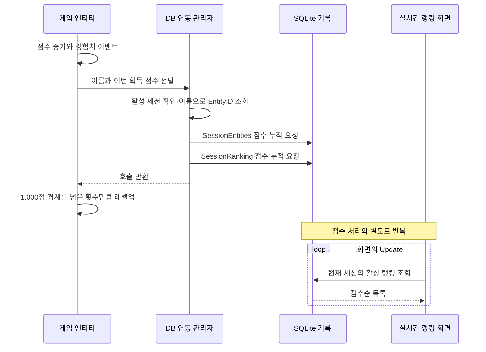
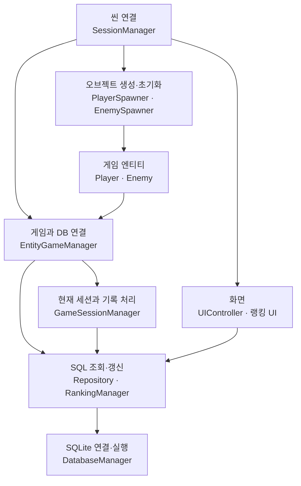

# Arrow.io 클론 프로젝트: 게임 기록이 랭킹 화면에 도달하기까지

개발 기간: **2025-05-20 ~ 2025-06-15**. 프로젝트명과 기간은 사용자 확인 사항입니다.

이 프로젝트의 핵심은 **Unity 안에서 발생한 점수·사망 이벤트를 SQLite 기록으로 남기고, 그 기록을 게임 중·종료 후·타이틀 랭킹으로 다시 보여주는 흐름**입니다. 플레이어와 AI는 공통 엔티티 구조를 사용하며, 한 게임의 참가 기록과 완료된 게임들의 기록을 구분해 조회합니다.

> 2026-10-02 UTC 재검토. 공개 코드의 호출 관계와 SQL을 정적으로 추적했습니다. Unity·DB 실행이나 플레이 테스트 결과가 아닙니다.
>
> **이 저장소는 바로 실행할 수 있는 Unity 프로젝트가 아닌 코드 검토용 선별 사본입니다.** 씬·프리팹·실제 ScriptableObject 데이터·외부 DLL 등이 없고, 제외된 `Projectile.cs` 때문에 해결되지 않는 타입 참조도 있습니다. 실행 범위, 팀 기여, 라이선스와 최초 게시 검증 기록은 부록에 남겼습니다.

## 1. 점수 한 번이 기록과 랭킹으로 이어지는 순서

**점수를 얻으면 게임 안의 수치를 먼저 바꾸고, 두 DB 기록에 획득 점수를 더하도록 요청한다. 랭킹 화면은 이 기록을 별도로 조회한다.**

[점수 블록][score-block]의 흡수가 끝나거나 처치 보상을 받을 때 공통 메서드인 [Entity.AddScore][entity]가 호출된다. 아래는 활성 세션과 대상 엔티티가 확인된 경우의 호출 순서다.

- **대상 식별:** [EntityGameManager][entity-manager]는 활성 세션이 있는지 확인한 뒤 이름으로 DB 엔티티를 찾는다. 점수 경로는 사망 처리의 인스턴스 ID 매핑을 사용하지 않는다.
- **두 기록에 누적:** [GameSessionManager][game-session]가 [SessionEntityRepository][session-entity]와 [RankingManager][ranking]를 차례로 호출한다. 전달값은 총점이 아니라 이번 획득 점수다.
- **다음 갱신:** [LiveRankingUI][live-ui]가 매 프레임 랭킹을 다시 조회한다. 경험치·레벨 HUD는 [UIController][ui]가 엔티티 이벤트를 받아 갱신한다.

그림의 DB 연동 관리자는 두 관리자를 묶어 표시했다. 이 경로에는 두 저장 작업을 묶는 트랜잭션이나 실패 시 게임 점수를 되돌리는 처리가 없다. 레벨업 결과도 DB에 전달하지 않으므로 게임 상태와 모든 기록이 항상 일치한다는 뜻은 아니다.

## 2. 사망 이벤트가 기록 종료와 결과 표시로 이어지는 과정

### 플레이어 사망: 같은 이벤트에 연결된 두 경로

[Player.Update][player]는 HP가 0 이하가 된 첫 프레임에 사망 플래그, 애니메이션, 콜라이더 비활성화를 처리하고 `onDeath`를 보낸다. 이후 프레임에는 공격·입력을 처리하지 않는다.

코드에서 확인되는 이벤트 등록 순서는 다음과 같다.

1. [Entity.Setup][entity]이 킬 로그, 마지막 공격자에게 400점 지급, 점수 블록 생성 처리를 등록한다.
2. [PlayerSpawner][player-spawner]가 사망 처리를 등록한다. 이벤트가 발생하면 `HandlePlayerDeath` → `SessionManager.EndGame` → `EntityGameManager.OnPlayerDeath` → `GameSessionManager.OnPlayerDeath`로 이어진다.
3. 플레이어 생성 이벤트를 받은 [SessionManager][session]가 UI를 연결하고, [UIController.Setup][ui]이 같은 `onDeath`에 종료 화면 표시를 등록한다.

DB 경로는 먼저 플레이어의 `SessionEntities`를 사망 상태로 바꾸고 `SessionRanking` 행을 비활성화한다. 두 작업이 성공하면 `EndSession`으로 넘어가 플레이어 통계, 세션 종료 정보, 모든 참가자의 랭킹 비활성화, 현재 세션·플레이어 ID 초기화를 처리한다.

**종료 화면은 DB 저장 성공 통지를 받아 열리는 구조가 아니다.** 별도 사망 리스너가 [GameOverUI.ShowGameOver][game-over]를 호출한다. `GameOverUI.Setup`이 세션 ID를 미리 보관하므로 현재 활성 ID가 초기화된 뒤에도 그 세션의 랭킹을 요청할 수 있다. 씬에 추가된 Inspector 이벤트나 실제 화면 결과는 확인하지 않았다.

실패 처리도 구분해야 한다. `OnPlayerDeath`는 사망 기록 처리에 실패하면 세션 종료를 중단한다. `EndSession`에 진입한 경우에는 세션 종료 UPDATE가 실패를 반환해도 랭킹 비활성화와 현재 ID 초기화를 계속한다. `SessionManager.EndGame` 또한 DB 결과를 확인하기 전에 자신의 게임 진행 플래그를 내린다.

### AI 사망: 기록 비활성화 후 풀 반환

[EnemySpawner][enemy-spawner]는 풀에서 적을 꺼내 초기화하고, [Enemy.Setup][enemy]은 AI를 세션에 등록한다. [DeadState.Enter][dead-state]가 사망 이벤트를 보내면 `StartDespawnTimer`의 코루틴이 인스턴스 ID 매핑으로 DB 사망 처리를 요청한다. 이후 5초를 기다렸다가 리스너를 정리하고 적을 풀에 반환한다.

DB에서 비활성화하는 시점과 게임 오브젝트가 풀로 돌아가는 시점은 다르다. 적 생성 간격은 DB에서 조회한 살아 있는 AI 수를 `spawnMultiplier`로 나누어 계산하며, 선언된 `maxEnemyCount = 10`은 이 경로의 상한 검사에 사용되지 않는다.

## 3. 플레이어 입력과 AI의 판단·실행

플레이어와 적은 [Entity][entity]의 피해·점수·무기·사망 이벤트를 공유한다. 플레이어는 방향키와 마우스로 이동·조준하고, 살아 있는 동안 `Update`에서 `Attack`을 호출한다. 적은 다음 과정을 반복한다.

1. **대상 선택:** [AIInput.Update][ai-input]가 탐색 범위와 레이어 조건에 맞는 콜라이더 중 자기 자신을 제외한 가장 가까운 `Entity`를 대상으로 저장한다.
2. **상태 판단:** [Enemy.Update][enemy]가 [FSM.Execute][fsm]를 호출한다. FSM은 전이를 순회하다 처음 참인 조건에서 멈춘다. 등록 순서는 사망 → 도주 → 공격 → 추적 → 순찰 → 대기다.
3. **상태 전환:** 선택된 상태가 현재 상태와 다르면 이전 상태의 `Exit`와 새 상태의 `Enter`를 호출한다. 같은 상태면 전환 없이 현재 상태의 `Execute`를 호출한다.
4. **공격 실행:** [AttackTransition][attack-transition]은 사거리와 장애물 레이캐스트를 확인한다. [AttackState][attack-state]는 대상을 향해 회전하고 각도 차가 5도 미만이면 `IAttack.Attack`을 요청한다.
5. **다음 판단:** 다음 프레임의 `FSM.Execute`에서 전이 조건을 다시 검사한다. 행동 완료 콜백을 기다려 다음 상태를 고르는 방식은 아니다.

전이 판단과 실제 발사 사이에도 조건이 있다. 공통 `Entity.Attack`이 [WeaponBase.Shot][weapon]을 호출하면, 무기는 투사체별 마지막 발사 시각과 `attackRate`를 확인해 발사 간격이 지난 항목만 생성한다. 투사체 기반 클래스가 제외되어 있으므로 충돌·피해 적용까지의 완전한 경로는 공개 사본만으로 확인할 수 없다.

등록된 순서대로 판단하려는 의도는 `Dictionary` 열거 순서에 기대고 있다. 이 순서에서는 항상 참인 [PatrolTransition][patrol-transition]이 `IdleTransition`보다 먼저 선택되므로 대기를 동등한 후순위 선택지로 읽으면 안 된다. 또한 `AIInput`과 `Enemy`는 별도 `Update`를 사용하므로, 대상 갱신이 같은 프레임의 FSM 판단보다 반드시 먼저 실행된다고 단정하지 않는다.

## 4. 저장 구조와 세 화면의 조회 기준

[DatabaseManager의 테이블 정의][database]는 다음처럼 역할을 나눈다.

| 저장 대상 | 역할과 연결 |
| --- | --- |
| `Players` | 이름, 최고 점수, 게임 수와 누적 플레이 시간 필드 |
| `Entities` | Player·AI 공통 식별자. 선택값인 `PlayerID`로 플레이어 기록과 연결 |
| `GameSessions` | 한 게임의 시작·종료 시각, 플레이 시간과 완료 여부 |
| `SessionEntities` | `SessionID + EntityID`별 점수·레벨·처치 수·생사 상태. 두 ID 조합은 유일 |
| `SessionRanking` | 같은 두 ID 조합의 임시 랭킹. 현재 점수와 활성 여부를 따로 저장 |

`SessionEntities`와 `SessionRanking`은 각각 `GameSessions`와 `Entities`를 외래 키로 참조한다. 전자는 완료된 게임 기록에도 사용하고, 후자는 현재 게임과 직전 종료 화면에 사용한다. **`SessionRanking`은 주석의 표현과 관계없이 실제 테이블이다.**

| 화면 | 실제 조회 경로 | 읽는 범위 |
| --- | --- | --- |
| 게임 중 [LiveRankingUI][live-ui] | `GetActiveSessionLiveRanking` | 현재 세션의 `SessionRanking` 중 `IsActive = TRUE` |
| 종료 [GameOverUI][game-over] | `GetSessionEndRanking` | 보관한 세션 ID의 `SessionRanking` 중 `IsActive = FALSE` |
| 타이틀 [TitleRanking][title-ranking] | `GetPlayerBestRanking` 또는 `GetAllTimeRanking` | 완료된 세션의 `SessionEntities`를 엔티티·세션 정보와 결합 |

생사 상태와 랭킹 활성 상태는 다르다. 세션 종료는 모든 참가자의 `SessionRanking.IsActive`를 내리지만, 살아 있던 모든 AI의 `SessionEntities.IsAlive`를 사망 상태로 바꾸지는 않는다.

실시간·종료 랭킹은 현재 점수 내림차순, 마지막 갱신 시각 오름차순으로 정렬하고 조회 코드에서 1부터 순위를 붙인다. **종료 화면은 저장된 `FinalRank`를 읽지 않는다.** 확인한 사망 호출은 `SetEntityDead`에 최종 순위로 0을 전달한다. 타이틀의 두 조회는 점수와 종료 시각으로 정렬하고 SQL의 `ROW_NUMBER()`로 순위를 계산한다.

DB에는 `AllTimeRanking`, `PlayerBestRanking`, `LiveRanking`, `SessionFinalRanking` 뷰도 정의되어 있다. 그러나 위 화면의 주요 조회 메서드는 해당 이름의 뷰를 그대로 읽지 않고 별도 SQL을 실행한다. `GetPlayerBestRanking`도 완료된 Player 참가 기록을 점수순으로 나열하므로 **계정별 최고 기록 한 건**을 보장하지 않는다.

새 게임의 `ClearAllSessionRanking`은 임시 랭킹 전체를 삭제한다. 타이틀 랭킹은 남아 있는 `SessionEntities`와 `GameSessions`를 사용하므로 이 삭제와 구분된다. `LiveRankingUI.Update`는 상위 목록 조회, 활성 엔티티 수 조회, 플레이어를 찾기 위한 목록 조회를 각각 호출한다. 이벤트 기반 갱신이나 성능 측정을 완료한 구조로 설명하지 않는다.

## 5. 게임 시작과 주요 시스템의 구성

### 주요 호출 의존성

이 그림은 주요 호출 의존성의 요약이다. 실행 순서, 클래스 상속 관계, 트랜잭션 범위를 나타내지 않는다. 점수·사망 이벤트의 시간 순서는 앞 절에서 따로 설명했다.

### 시작 순서와 진행 조건

[SessionManager][session]는 `Awake`에서 스포너에 피해 팝업·킬 로그·점수 블록 관리자와 기본 능력치를 전달하고, 생성·사망 이벤트를 구독한다. `Start`에서 호출하는 `StartGame`은 다음 순서로 진행된다.

1. 이미 게임이 진행 중이면 반환한다. 그 외에는 이전 게임의 임시 랭킹인 `SessionRanking` 전체 삭제를 요청한다.
2. [EntityGameManager.StartNewGame][entity-manager]이 기존 활성 세션의 강제 종료를 요청하고, Unity 인스턴스와 DB 엔티티의 ID 매핑을 초기화한다.
3. [GameSessionManager.StartSession][game-session]이 플레이어 → 플레이어 엔티티 → 게임 세션 → 세션 참가 기록을 차례로 만든다. 각 생성 결과가 null이면 중단한다.
4. 현재 세션·플레이어 ID를 저장한 뒤 실시간 랭킹 행 생성을 요청한다. **이 마지막 요청의 반환값은 검사하지 않는다.**
5. 세션 객체가 반환되면 `SessionManager`가 진행 플래그를 올리고 플레이어를 생성한다. 생성 이벤트에서 UI와 카메라를 연결하고 플레이어 인스턴스 ID를 DB 엔티티 ID에 대응시킨다.

앞에서 생성한 행을 실패 시 되돌리는 처리는 이 경로에 없다. 임시 랭킹 삭제나 기존 세션 정리의 성공 여부도 새 게임 진행 조건으로 검사하지 않는다. 따라서 세션 객체가 반환됐다는 사실과 전체 초기화의 성공 보장은 구분해야 한다.

`StartSession`의 주석에는 기존 플레이어 조회도 언급되어 있지만, 실제 [PlayerRepository.CreatePlayer][player-repository]는 매번 `INSERT`한다. 같은 이름을 다시 입력해도 기존 계정을 재사용하는 구조로 설명할 수 없다.

DB 연결은 별도 [DatabaseInitializer][initializer]가 담당한다. 코드의 기본 설정은 `Awake`에서 초기화하는 것이며, [DatabaseManager.Initialize][database]가 `Application.persistentDataPath/gamedata.db`를 열고 테이블·인덱스·뷰를 준비한다. 씬이 빠져 있으므로 컴포넌트 배치, Inspector 설정과 실제 초기화 성공 여부는 확인하지 않았다.

## 6. 코드에서 확인한 한계와 읽기 순서

다음은 위 호출 경로를 읽을 때 특히 구분해야 할 부분이다. 코드 수정이나 실행 테스트로 해결한 항목은 아니다.

| 확인 지점 | 현재 구현에서 확인한 내용 |
| --- | --- |
| 점수 대상 식별 | [GetEntityByName][entity-repository]은 현재 세션이 아닌 전체 `Entities`에서 이름을 찾고 `CreatedAt DESC LIMIT 1`로 고른다. 점수 호출은 타입도 지정하지 않으며 이름 유일성·동일 생성시각의 추가 정렬 기준이 없어 현재 참가자 식별을 보장하지 않는다. |
| 저장 실패 | 게임 메모리 점수와 두 DB 기록을 묶는 롤백이 없다. `DatabaseManager.BeginTransaction`은 정의되어 있지만 공개 스크립트에서 호출처를 찾지 못했다. |
| 레벨·처치 수 | `Entity.AddScore`는 레벨 인자를 전달하지 않는다. 처치 보상도 이 메서드를 사용하며, 별도 `OnEntityKilled`·`IncrementEntityKills` 경로를 호출하지 않는다. 게임 레벨·점수 증가와 DB 레벨·처치 수 갱신을 동일시할 수 없다. |
| 플레이 시간 누적 | [GameSessionManager.EndSession][game-session]은 세션의 기존 `PlayTimeSeconds`를 플레이어 통계에 더한 뒤, [GameSessionRepository.EndSession][session-repository]에서 최종 경과 시간을 계산·저장한다. 누적 통계 반영 순서를 검토해야 한다. |
| 전투·화면 연결 | 스킬 초기화 오버로드를 사용하지 않는 플레이어 생성 경로, UI null 접근 가능성, UnityEditor 참조 등 기존 정적 제약은 부록에 보존했다. |

권장 읽기 순서는 **`Entity.AddScore` → `EntityGameManager` → `GameSessionManager` → `SessionEntityRepository`·`RankingManager` → 화면 코드**다. 다음으로 `Player`·`Enemy`의 사망 이벤트와 FSM을 읽고, `SessionManager`의 시작 연결 및 `DatabaseManager`의 스키마를 확인하면 실행과 구성을 구분하기 쉽다. 팀 담당은 [CONTRIBUTIONS.md](CONTRIBUTIONS.md)를 참조한다.

## 7. 문서 기준과 검증 범위

본문 코드 링크는 공개 사본의 최초 게시 커밋 [`4b6183c3`](https://github.com/als79gur49/2025-DB-TeamProject-code-portfolio/commit/4b6183c3c6b58f403333e23d965aa582ae9a2ae3)에 고정했다. 재검토 시작 시 공개 main [`a9adff61`](https://github.com/als79gur49/2025-DB-TeamProject-code-portfolio/commit/a9adff61a1559f2fca224a8dc964e1161a626a68)과 비교해 README 외 파일의 blob이 같음을 확인했다. 원본 비공개 저장소는 이번 설명 작성 과정에서 새로 조회하지 않았다. 원본 버전과 선별 경위는 아래 최초 게시 기록을 따른다.

이번 변경 대상은 `README.md`뿐이다. 코드·설정 82개와 출처·검증 파일은 변경하지 않는다. [MANIFEST.csv](MANIFEST.csv)의 원본 파일 해시는 그대로 유효하며, [VALIDATION.json](VALIDATION.json)에 기록된 **README 크기·SHA-256는 최초 게시 당시 README의 값**이다. 갱신된 README에 적용하는 해시가 아니다. 최초 버전은 [이 링크](https://github.com/als79gur49/2025-DB-TeamProject-code-portfolio/blob/4b6183c3c6b58f403333e23d965aa582ae9a2ae3/README.md)에서 확인할 수 있다.

공개 스크립트의 호출 관계와 SQL, 코드 링크, Mermaid 블록의 기본 구조를 정적으로 점검했다. Unity·DB 실행, 빌드, 성능 측정은 하지 않았으며 GitHub의 실제 다이어그램 렌더링도 검증하지 않았다. 씬·외부 구현에서 추가되는 동작, 실패의 모든 조합이나 전체 결함을 검증한 문서는 아니다.

## 부록: 최초 공개 범위·출처·보존 기록

최초 공개 범위·출처·보존 기록 펼치기

아래는 최초 게시 문서의 범위와 제한을 보존한 기록입니다. “최종” 파일 목록과 해시 설명은 최초 게시 시점 기준으로 읽어야 합니다.

원본: 비공개 [als79gur49/2025-DB-TeamProject](https://github.com/als79gur49/2025-DB-TeamProject), `Branch_03_Diet`의 고정 커밋 [`67ee6cdf472e2a3888d367b96d426ae3cf9443da`](https://github.com/als79gur49/2025-DB-TeamProject/commit/67ee6cdf472e2a3888d367b96d426ae3cf9443da). 모든 보존 파일은 이 커밋을 기준으로 합니다. 링크는 원본 접근 권한이 있어야 열립니다.

### 검토 범위와 실행 제한

원본 트리의 파일 14,099개 중 `Assets/Scripts` C# 84개와 `Assets/SO` C# 3개를 후보로 삼아, 승인된 8개를 제외한 **C# 79개**를 보존했습니다. `Assets/SO`의 3개는 ScriptableObject **클래스 정의**이며 실제 `.asset` 인스턴스는 포함하지 않습니다. 설정 3개는 `ReviewContext` 아래에 원래 경로를 유지했습니다.

총 **87개 파일**: 코드 79 + 설정 3 + `README.md`, `CONTRIBUTIONS.md`, `MANIFEST.csv`, `VALIDATION.json`, `.gitignore` 5개. 원본에서 보존하지 않은 파일은 14,017개입니다. 원본 Git 이력과 `.git`은 포함하지 않으며 로컬 Git 초기화는 수행하지 않았습니다. 공개 게시 대상은 [als79gur49/2025-DB-TeamProject-code-portfolio](https://github.com/als79gur49/2025-DB-TeamProject-code-portfolio)입니다. 사용자가 이 정확한 저장소 이름과 Public 게시를 승인했습니다. 원본 저장소는 비공개로 유지하며, 게시 사본은 원본 이력을 가져오지 않는 별도 코드 검토 자료입니다. 최종 원격 파일 목록과 blob 검증 결과는 게시 완료 보고에서 별도로 확인할 수 있습니다.

**이 사본은 실행·빌드할 수 있는 Unity 프로젝트가 아닙니다.** 씬, 프리팹, meta, 모델, UI 리소스, DLL 및 외부 패키지 구현을 제외했습니다. `Projectile.cs` 제외로 `Straight`, `ProjectileStorage`, `WeaponBase`, `Entity` 등의 타입 참조도 해결되지 않습니다. `ReviewContext` 설정은 버전과 의존성 이해를 위한 자료이며 실행 환경을 복구하지 않습니다. Unity 실행, DB 실행, 빌드, 자동 테스트는 수행하지 않았습니다. 바이트 일치 검증은 실행 동작의 검증을 의미하지 않습니다.

### 권장 읽기 순서

1. [기여 구분](CONTRIBUTIONS.md)과 [파일별 목적·해시](MANIFEST.csv)를 먼저 확인합니다.
2. `Assets/Scripts/SessionManager.cs` → `PlayerSpawner.cs`, `EnemySpawner.cs`, `EntitySpawner.cs`: 의존성 주입, 세션 시작·종료, 스폰 이벤트, UI·카메라 연결.
3. `Assets/Scripts/Entity`와 `FSM`: 공통 엔티티의 점수·피해·사망 이벤트, 플레이어 입력, 적 AI의 상태·전이 분리와 풀 반환.
4. `Assets/Scripts/DB/DatabaseManager.cs` → `Models` → 각 `Repository` → `GameSessionManager.cs`, `EntityGameManager.cs`: 테이블과 뷰, 데이터 모델, SQL 접근, Unity 인스턴스와 DB 엔티티 매핑.
5. `DB/RankingManager.cs` → `UI/UIController.cs`, `UI/GameOverUI.cs`, `UI/LiveRankingUI.cs`, `etc/TitleRanking.cs`, `etc/TitlePlayerInfo.cs`: 실시간·종료·완료 기록 조회와 화면 표시.
6. `Weapon`, `Assets/SO`, `Entity/Player/LevelupStorage.cs`: 무기·스킬 데이터와 레벨업 연결. 제외된 투사체 기반 클래스와 외부 구현이 필요한 구조입니다.

DB 코드는 `Players`, `Entities`, `GameSessions`, `SessionEntities`, `SessionRanking`과 `AllTimeRanking`, `PlayerBestRanking`, `LiveRanking`, `SessionFinalRanking` 뷰를 정의합니다. 실제 DB 파일이나 레코드는 포함하지 않았습니다. `GetPlayerBestRanking` 메서드의 쿼리는 동명의 DB 뷰를 그대로 조회하는 구현이 아니므로 둘을 구별해서 읽어야 합니다.

### 버전과 외부 의존성

Unity **2022.3.33f1**, 리비전 **b2c853adf198**는 `ReviewContext/ProjectSettings/ProjectVersion.txt`의 값입니다. 아래 패키지 버전은 보존된 manifest와 lock의 최상위 resolved 항목을 기준으로 합니다. lock 안의 다른 패키지가 요청하는 하위 버전과 구별했습니다.

| 패키지 | 버전 | 근거 |
|---|---|---|
| Universal Render Pipeline | 14.0.11 | manifest / lock |
| Cinemachine | 2.10.3 | manifest / lock |
| AI Navigation | 1.1.6 | manifest / lock |
| Input System | 1.7.0 | manifest / lock |
| TextMesh Pro | 3.0.6 | manifest / lock |
| Test Framework | 1.1.33 | manifest / lock |
| Timeline | 1.7.6 | manifest / lock |
| Visual Scripting | 1.9.4 | manifest / lock |
| Burst | 1.8.15 | lock |
| Mathematics | 1.2.6 | lock |

전체 직접 의존성 45개와 lock의 resolved 항목 53개는 보존 설정에서 확인할 수 있습니다. 일부 입력 코드는 패키지 존재와 별개로 기존 `UnityEngine.Input` API를 사용합니다.

제외된 DLL에 대한 별도 원본 조사 근거의 DOTween 내장 버전 문자열은 **1.2.765**, Pro는 **1.0.381**입니다. 둘의 PE FileVersion **1.0.0.0**과 구별합니다. Mono.Data.Sqlite는 AssemblyVersion **4.0.0.0**, FileVersion **1.0.61.0**이며 sqlite3 엔진 버전은 미확인입니다. 이 사본은 DLL을 포함하지 않고, DLL 버전을 자체 바이트 검증한 사본도 아닙니다. 게임 코드는 `DG.Tweening`, `Mono.Data.Sqlite`, Unity 패키지 API와 원본 리소스에 의존합니다.

### 제외 원칙

모든 미디어·폰트·SDF·DB 바이너리·DLL·모델·셰이더·씬·프리팹·meta·SO 인스턴스·외부 패키지 구현을 제외했습니다. `Assets/Plugins`, `Assets/Synty`, `Assets/GUI Assets`, `Assets/VFX_Klaus`, `Assets/StreamingAssets`에서 보존한 파일은 **0개**입니다. 종류별 수량과 전체 제외 확장자 집계는 아래 표와 `VALIDATION.json`에서 확인할 수 있습니다. 수량은 폴더가 아닌 원본 트리의 파일 수입니다.

| 제외 종류 | 파일 수 |
|---|---:|
| meta | 7172 |
| 씬 / 프리팹 | 12 / 1322 |
| 이미지 | 4007 |
| 폰트 TTF | 7 |
| 모델 FBX·OBJ | 939 |
| DLL / DB 바이너리 | 8 / 3 |
| 셰이더·그래프·include | 29 |
| 직렬화 asset | 56 |
| C# | 36 |
| 위 분류 외 나머지 | 426 |

직렬화 asset 56개에는 파일명 기준 SDF 10개와 SO 인스턴스 5개가 포함됩니다. C# 제외 36개는 후보 제외 8개와 후보 경로 밖 28개입니다. 이 세부 수량은 위 분류와 중복되므로 합산하지 않습니다.

| 전체 제외한 리소스 폴더 | 원본 파일 수 | 보존 수 |
|---|---:|---:|
| `Assets/Plugins/` | 358 | 0 |
| `Assets/Synty/` | 1379 | 0 |
| `Assets/GUI Assets/` | 8465 | 0 |
| `Assets/VFX_Klaus/` | 201 | 0 |
| `Assets/StreamingAssets/` | 6 | 0 |

폴더별 수량은 확장자 분류와 중복됩니다. 원본 Git 이력은 원본 트리 파일 수에 포함되지 않으며 따로 취득·보존하지 않았습니다.

승인된 C# 제외 목록(모두 `Assets/Scripts/` 기준):

| 상대 경로 | 제외 이유 |
|---|---|
| `Weapon/Projectile/Projectile.cs` | 외부 VFX 구현과 공통 구간이 확인되어 파일 전체 제외 |
| `FSM/InputData.cs` | 승인된 선별 제외 |
| `Utils/RandomSkin.cs` | 승인된 선별 제외 |
| `etc/InputField.cs` | 승인된 선별 제외 |
| `Weapon/Effect/MoreDamageEffect.cs` | 승인된 선별 제외 |
| `Weapon/Effect/PoisonEffect.cs` | 승인된 선별 제외 |
| `Weapon/Effect/ProjectileEffect.cs` | 승인된 선별 제외 |
| `Utils/CoroutineSingleton.cs` | 승인된 선별 제외 |

`Projectile.cs`의 발사·충돌 VFX 구간은 초기 커밋 [`62cd4d1`](https://github.com/als79gur49/2025-DB-TeamProject/commit/62cd4d1a0fa975b8fe5a30da4658b87180880541)의 `Assets/VFX_Klaus/Scripts/ProjectileMove.cs`와 공통 구현이 확인됩니다. 복제 경위나 권리 침해를 단정하지 않으며, 파일에 있는 게임 통합 코드 전체가 외부 원작이라는 뜻도 아닙니다. 다른 파일에 외부 차용이 전혀 없다고 보증하지 않습니다.

### 정적 검토에서 확인한 한계

| 위치 | 확인 사항 |
|---|---|
| `DB/RankingManager.cs`, `FSM/State/AttackState.cs`, `ScoreBlockSpawner.cs`, `UI/GameOverUI.cs`, `etc/TitleSceneManager.cs` | `UNITY_EDITOR` 조건 없이 UnityEditor namespace를 import하는 5개 파일. 플레이어 빌드 제약을 검토해야 함 |
| `DB/GameSessionManager.cs` → `GameSessionRepository.cs` | `EndSession()`에서 플레이 시간 통계를 누적한 뒤 세션 종료 시각·PlayTimeSeconds를 갱신하므로 누적 순서 문제 존재 |
| `PlayerSpawner.cs` → `Entity/Player.cs` | 스킬 초기화가 있는 `Player.Setup(..., SkillIconManager)` 오버로드 대신 기본 Setup을 호출함 |
| `etc/TitlePlayerInfo.cs` | `highestScore != null || highestData != null` 조건 뒤 양쪽을 참조하여 null 접근 가능 |
| `DB/RankingManager.cs` | `GetPlayerBestRanking`은 완료된 Player 기록을 점수순으로 나열하며 계정별 최고 1건을 보장하지 않음 |
| `DB/RankingManager.cs` | `GetPlayerTotalPlayTime`, `GetCreatedAt`, `GetLastPlayedAt`는 특정 계정이 아닌 전체 시스템 범위 조회 |

이 목록은 실행 테스트 결과나 결함 전수 목록이 아닙니다. 검토용 사본의 원본 코드는 수정하지 않았습니다.

### 바이트 보존과 검증 읽기

82개 원본 파일에 대해 Git blob SHA-1(`blob <바이트수>\0` + 본문), 원본 트리 크기, 로컬 SHA-256를 확인했습니다. 텍스트 전송 중 변환된 26개는 원래 CP949 바이트로 복원했습니다. 이 중 6개는 전송 문자가 Windows-1252로 해석된 형태여서 역변환이 필요했고, 최종 원본 해시와 크기의 일치로 채택했습니다. UTF-8 56개(설정 3개 포함)와 CP949 26개를 원래 바이트 그대로 보존했습니다. 줄바꿈과 BOM도 원본 바이트의 일부로 검증됩니다.

`Entity.cs`의 주석에 U+FFFD **4개**, `Player.cs`의 주석에 **67개**가 원본 blob 자체에 존재합니다. 원본 해시 일치로 확인한 기존 문자 손상을 보존한 것이며, 임의 복원하거나 손실이 없는 텍스트라고 표시하지 않습니다. 새 전송 손상을 해시 불일치 상태로 채택한 파일은 없습니다.

원본 `.gitattributes`는 `* text=auto`로 줄바꿈 정규화를 유발할 수 있어 **미채택**했습니다. LFS filter 선언은 없습니다. 새로운 `.gitignore`는 모든 파일을 기본 제외하고 87개 경로와 필요한 부모 폴더만 명시적으로 허용합니다. 이 파일이 향후 Git의 전역 `core.autocrlf`나 외부 filter 설정까지 통제하지는 않습니다.

`MANIFEST.csv`는 코드 79개와 설정 3개의 정확한 경로·목적·인코딩·크기·원본 blob SHA·SHA-256를 담습니다. `VALIDATION.json`은 최종 87개 전체 파일 목록과 검증 범위를 담으며, 자기 파일의 해시는 순환 참조 때문에 파일 안에 넣지 않습니다. 별도로 전달한 최종 `VALIDATION.json` SHA-256로 해당 파일을 확인할 수 있습니다.

### 팀 기여와 출처의 한계

팀 역할은 권민혁: 게임플레이·DB 연동·UI 게임 로직 연결, 김지호: DB 스키마·SQL·관리, 전민균: UI/UX로 사용자 확인됐습니다. 개인 구현, 팀 기반 코드, 후속 공동 수정의 구분과 원본 커밋 링크는 `CONTRIBUTIONS.md`에 기록했습니다.

팀 코드와 이름 공개 동의는 **사용자 확인 사항**이며 독립적인 법적 검증이 아닙니다. 이 선별 사본의 지정 저장소 Public 게시는 별도로 사용자 승인됐습니다. 다른 대상의 재배포 권한이나 외부 구현의 권리까지 확정한 것은 아닙니다. 새 OSS 라이선스를 부여하지 않았습니다. 선별, 해시, 커밋 diff 검토는 전체 코드의 독창성이나 외부 리소스의 재배포 권한을 확정하지 않습니다.

[session]: https://github.com/als79gur49/2025-DB-TeamProject-code-portfolio/blob/4b6183c3c6b58f403333e23d965aa582ae9a2ae3/Assets/Scripts/SessionManager.cs
[entity-manager]: https://github.com/als79gur49/2025-DB-TeamProject-code-portfolio/blob/4b6183c3c6b58f403333e23d965aa582ae9a2ae3/Assets/Scripts/DB/EntityGameManager.cs
[game-session]: https://github.com/als79gur49/2025-DB-TeamProject-code-portfolio/blob/4b6183c3c6b58f403333e23d965aa582ae9a2ae3/Assets/Scripts/DB/GameSessionManager.cs
[player-spawner]: https://github.com/als79gur49/2025-DB-TeamProject-code-portfolio/blob/4b6183c3c6b58f403333e23d965aa582ae9a2ae3/Assets/Scripts/PlayerSpawner.cs
[player-repository]: https://github.com/als79gur49/2025-DB-TeamProject-code-portfolio/blob/4b6183c3c6b58f403333e23d965aa582ae9a2ae3/Assets/Scripts/DB/PlayerRepository.cs
[initializer]: https://github.com/als79gur49/2025-DB-TeamProject-code-portfolio/blob/4b6183c3c6b58f403333e23d965aa582ae9a2ae3/Assets/Scripts/DB/DatabaseInitializer.cs
[database]: https://github.com/als79gur49/2025-DB-TeamProject-code-portfolio/blob/4b6183c3c6b58f403333e23d965aa582ae9a2ae3/Assets/Scripts/DB/DatabaseManager.cs
[entity]: https://github.com/als79gur49/2025-DB-TeamProject-code-portfolio/blob/4b6183c3c6b58f403333e23d965aa582ae9a2ae3/Assets/Scripts/Entity/Entity.cs
[session-entity]: https://github.com/als79gur49/2025-DB-TeamProject-code-portfolio/blob/4b6183c3c6b58f403333e23d965aa582ae9a2ae3/Assets/Scripts/DB/SessionEntityRepository.cs
[ranking]: https://github.com/als79gur49/2025-DB-TeamProject-code-portfolio/blob/4b6183c3c6b58f403333e23d965aa582ae9a2ae3/Assets/Scripts/DB/RankingManager.cs
[live-ui]: https://github.com/als79gur49/2025-DB-TeamProject-code-portfolio/blob/4b6183c3c6b58f403333e23d965aa582ae9a2ae3/Assets/Scripts/UI/LiveRankingUI.cs
[ui]: https://github.com/als79gur49/2025-DB-TeamProject-code-portfolio/blob/4b6183c3c6b58f403333e23d965aa582ae9a2ae3/Assets/Scripts/UI/UIController.cs
[game-over]: https://github.com/als79gur49/2025-DB-TeamProject-code-portfolio/blob/4b6183c3c6b58f403333e23d965aa582ae9a2ae3/Assets/Scripts/UI/GameOverUI.cs
[title-ranking]: https://github.com/als79gur49/2025-DB-TeamProject-code-portfolio/blob/4b6183c3c6b58f403333e23d965aa582ae9a2ae3/Assets/Scripts/etc/TitleRanking.cs
[player]: https://github.com/als79gur49/2025-DB-TeamProject-code-portfolio/blob/4b6183c3c6b58f403333e23d965aa582ae9a2ae3/Assets/Scripts/Entity/Player.cs
[session-repository]: https://github.com/als79gur49/2025-DB-TeamProject-code-portfolio/blob/4b6183c3c6b58f403333e23d965aa582ae9a2ae3/Assets/Scripts/DB/GameSessionRepository.cs
[enemy-spawner]: https://github.com/als79gur49/2025-DB-TeamProject-code-portfolio/blob/4b6183c3c6b58f403333e23d965aa582ae9a2ae3/Assets/Scripts/EnemySpawner.cs
[enemy]: https://github.com/als79gur49/2025-DB-TeamProject-code-portfolio/blob/4b6183c3c6b58f403333e23d965aa582ae9a2ae3/Assets/Scripts/Entity/Enemy.cs
[fsm]: https://github.com/als79gur49/2025-DB-TeamProject-code-portfolio/blob/4b6183c3c6b58f403333e23d965aa582ae9a2ae3/Assets/Scripts/FSM/FSM.cs

[score-block]: https://github.com/als79gur49/2025-DB-TeamProject-code-portfolio/blob/4b6183c3c6b58f403333e23d965aa582ae9a2ae3/Assets/Scripts/ScoreBlock.cs#L138
[dead-state]: https://github.com/als79gur49/2025-DB-TeamProject-code-portfolio/blob/4b6183c3c6b58f403333e23d965aa582ae9a2ae3/Assets/Scripts/FSM/State/DeadState.cs#L15
[ai-input]: https://github.com/als79gur49/2025-DB-TeamProject-code-portfolio/blob/4b6183c3c6b58f403333e23d965aa582ae9a2ae3/Assets/Scripts/FSM/AIInput.cs#L19
[attack-transition]: https://github.com/als79gur49/2025-DB-TeamProject-code-portfolio/blob/4b6183c3c6b58f403333e23d965aa582ae9a2ae3/Assets/Scripts/FSM/Transition/AttackTransition.cs#L13
[attack-state]: https://github.com/als79gur49/2025-DB-TeamProject-code-portfolio/blob/4b6183c3c6b58f403333e23d965aa582ae9a2ae3/Assets/Scripts/FSM/State/AttackState.cs#L18
[weapon]: https://github.com/als79gur49/2025-DB-TeamProject-code-portfolio/blob/4b6183c3c6b58f403333e23d965aa582ae9a2ae3/Assets/Scripts/Weapon/WeaponBase.cs#L15
[patrol-transition]: https://github.com/als79gur49/2025-DB-TeamProject-code-portfolio/blob/4b6183c3c6b58f403333e23d965aa582ae9a2ae3/Assets/Scripts/FSM/Transition/PatrolTransition.cs#L11
[entity-repository]: https://github.com/als79gur49/2025-DB-TeamProject-code-portfolio/blob/4b6183c3c6b58f403333e23d965aa582ae9a2ae3/Assets/Scripts/DB/EntityRepository.cs#L116
